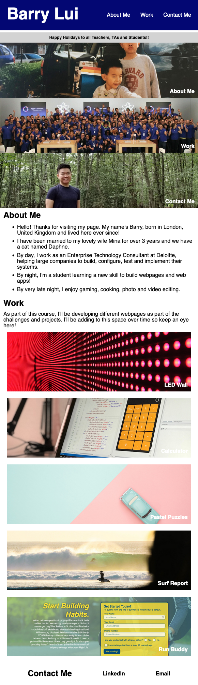

# Portfolio Page for Barry Lui (rebuilt using Bootstrap)

## Description 

This webpage is my portfolio page which has been rebuilt using Bootstrap. The code has been assembled by myself but largely helped by using Bootstrap elements from the documentation of Bootstrap v4.6. It has been a great opportunity for me to apply the knowledge learned over the course of the previous weeks but also utilise a framework to enable rapid builds whilst still following best practices.

Following this task, I've massively enhanced my skills to utilise the Bootstrap framework and grown a real appreciation for the Bootstrap framework (I was particularly blown away by the Navbar component and the fact that it automatically builds a hamburger menu for you with all the buttons you have added).

The greatest challenge I had to overcome when building this page was customising the Bootstrap components. In a way, this was slightly harder than building your own components from scratch as I wasn't always sure what was customisable.

### Useful Links
[GitHub Repository: Bootstrap-Portfolio](https://github.com/barrylui88/Bootstrap-Portfolio)

[Deployed Page (powered by GitHub Pages)](https://barrylui88.github.io/Bootstrap-Portfolio//)

## Installation

No installation is required - simply follow the URLs I have included above.

## Screenshots

###### Full Webpage Screenshot

###### Narrow Webpage Screenshot

## License

MIT License

Copyright (c) 2023 Barry Lui

Permission is hereby granted, free of charge, to any person obtaining a copy
of this software and associated documentation files (the "Software"), to deal
in the Software without restriction, including without limitation the rights
to use, copy, modify, merge, publish, distribute, sublicense, and/or sell
copies of the Software, and to permit persons to whom the Software is
furnished to do so, subject to the following conditions:

The above copyright notice and this permission notice shall be included in all
copies or substantial portions of the Software.

THE SOFTWARE IS PROVIDED "AS IS", WITHOUT WARRANTY OF ANY KIND, EXPRESS OR
IMPLIED, INCLUDING BUT NOT LIMITED TO THE WARRANTIES OF MERCHANTABILITY,
FITNESS FOR A PARTICULAR PURPOSE AND NONINFRINGEMENT. IN NO EVENT SHALL THE
AUTHORS OR COPYRIGHT HOLDERS BE LIABLE FOR ANY CLAIM, DAMAGES OR OTHER
LIABILITY, WHETHER IN AN ACTION OF CONTRACT, TORT OR OTHERWISE, ARISING FROM,
OUT OF OR IN CONNECTION WITH THE SOFTWARE OR THE USE OR OTHER DEALINGS IN THE
SOFTWARE.